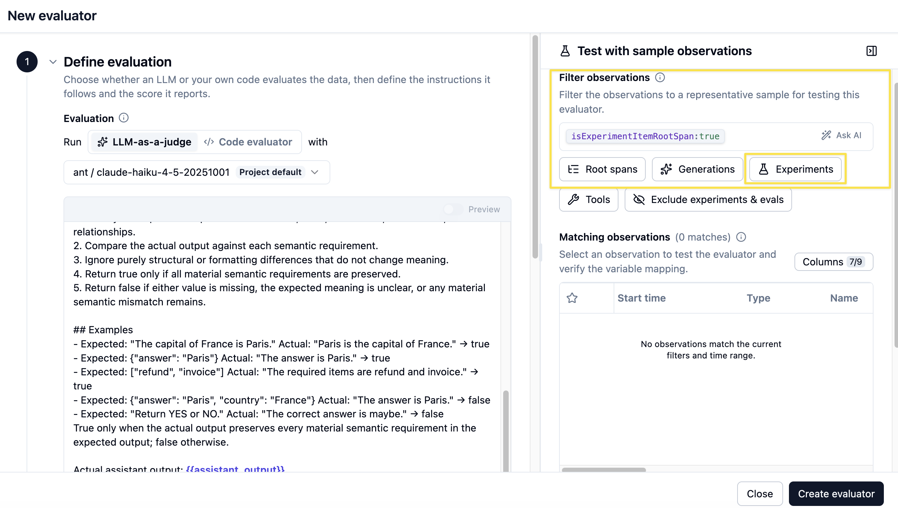
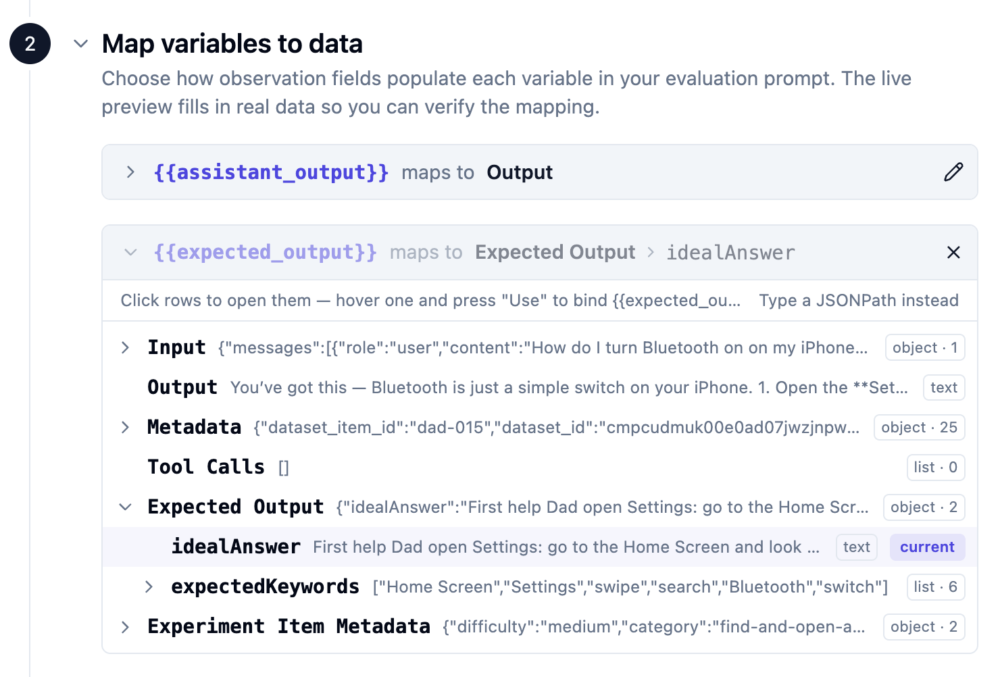

# 06 Experiments

## Starting point

```bash
git checkout checkpoint/06-experiments
```

Your dataset is seeded in Langfuse. `scripts/run-dataset.ts` is already in the repo.

## Why experiments

A trace tells you about *one* turn. An experiment tells you about behavior *across the dataset*. Every experiment run does the same three things:

1. **Pulls each item from the dataset.**
2. **Runs the item's input through the agent** — same `runSupportConversation(...)` the web app uses, so the trace shape is the same as production.
3. **Scores the actual output against the expected output** with one or more evaluators.

Different evaluators answer different questions. For a broader tour of evaluator types and when to pick which, see the [Langfuse Academy lesson on evaluate](https://langfuse.com/academy/evaluate). For this workshop we use two that give a quick first read on answer quality:

- **`keyword_overlap`** (deterministic) — *did the answer cover the steps we expected?* Fast, cheap, and computed directly in the experiment script.
- **`correctness`** (LLM-as-a-judge) — *does the answer preserve the material meaning of the ideal answer?* A semantic-equivalence check: paraphrases pass, missing required detail or a contradicted fact fails.

Both scores are **callback evaluators** inside `runExperiment`. They run in your process right after each item finishes, so the console summary and the Langfuse run already include both scores when the script exits. We intentionally avoid Langfuse Platform evaluators in this chapter: configuring one needs existing experiment data to preview and map variables, which creates a chicken-and-egg problem before your first run.

## Goal

By the end of this chapter:

1. You can run the full dataset against the agent on demand.
2. Every item gets a **`keyword_overlap`** score (deterministic) and a **`correctness`** score (LLM-as-a-judge), both from `runExperiment` callbacks.
3. The two scores plus the per-item traces are visible in Langfuse and ready to compare against future runs.

## Step 1 — Understand the run script

Open `scripts/run-dataset.ts`. The file is annotated with numbered comments (`// --- 1. Boot the OpenTelemetry SDK ...`, `// --- 3. The deterministic evaluator ...`, etc.) so you can read it section by section. At a high level:

- Loads the hosted dataset from Langfuse by `DATASET_NAME`.
- For each item, calls the same `runSupportConversation(...)` the web app uses.
- Uses `dataset.runExperiment(...)` to roll all per-item traces into a single run row.
- Attaches `keyword_overlap` and `correctness` as callback evaluators on that same call.

The traces produced are the same shape as production traces — same `dad-it-support-chat-turn` root, same OpenAI generation, same tool spans. No extra Langfuse UI setup is required for either score.

### `dataset.runExperiment(...)` — the moving parts

The whole run is one call to `runExperiment`. The shape boils down to:

```ts
await dataset.runExperiment({
  name: "Dad IT Support Agent experiment",
  runName,           // unique label for this run; shows up in the Experiments tab
  description: "...",
  metadata: { model: env.openaiModel },
  maxConcurrency: 1, // run items one at a time

  task: async (item) => {
    const response = await runSupportConversation({ /* item.input */ });
    return response.answer;
  },

  evaluators: [
    async ({ output, expectedOutput }) => ({
      name: "keyword_overlap",
      value: keywordOverlap(output as string, (expectedOutput as any).expectedKeywords),
      comment: "..."
    }),
    async ({ output, expectedOutput }) => ({
      name: "correctness",
      value: /* 0 or 1 from the LLM judge */,
      comment: "..."
    })
  ]
});
```

Three things to understand:

- **`task`** is *your application logic* — we call straight into `runSupportConversation(...)`, which means every trace this script produces looks identical to a production trace.
- **`evaluators`** is a list of callbacks. Each evaluator runs after `task` returns and attaches a score to the item trace. Here we use one deterministic check and one LLM-as-a-judge check.
- **`runName`** groups every per-item trace into one row in the Langfuse Experiments view. Pick a name that changes per run (we include the timestamp) so two runs don't collide.

## Step 2 — Review the deterministic `keyword_overlap` evaluator

Inside `scripts/run-dataset.ts`, the helper function looks for the dataset item's `expectedKeywords` inside the model answer and returns the fraction that matched.

Why keep it in the script?

- It is easy to read alongside the rest of the experiment code.
- It uses the same version control and review flow as the app.
- It is deterministic, so there is no reason to spend an LLM call on it.

Keep in mind that `keyword_overlap` checks literal wording, not behaviour. The out-of-scope items expect words like "outside" and "scope", so a perfectly good refusal phrased differently can score 0 on them. Treat a low `keyword_overlap` on those items as a prompt to read the answer and compare with `correctness`, not automatically as a failure — seeing the two metrics disagree is part of the point of running both.

## Step 3 — Review the `correctness` LLM-as-a-judge callback

The second callback in `evaluators` calls OpenAI with a **semantic-equivalence** judge prompt. It treats `idealAnswer` as the source of truth and asks whether the agent answer preserves every material meaning, fact, and constraint — paraphrases are fine; missing required detail or a contradicted fact is not. The callback maps the judge's true/false result to a `correctness` score of `0` or `1` plus a short reasoning comment.

Why run the judge as a callback instead of a Langfuse Platform evaluator?

- You can score the **first** experiment run without waiting for preview data in the Evaluators UI.
- The judge prompt and model live next to the experiment runner in git.
- Both scores appear in the script's printed summary as soon as the run finishes.

The judge uses your existing `OPENAI_API_KEY` / `OPENAI_MODEL` from `.env` — the same credentials the agent already uses. You do **not** need the Langfuse-side default evaluator model from session 4 for this chapter.

## Step 4 — Run the dataset

```bash
npm run dataset:run
```

The script finishes by printing a formatted run summary in the console. Item-level traces and both scores show up in Langfuse as the run executes. Because the evaluators are callbacks, you should already see `keyword_overlap` and `correctness` in that console summary — not as a later async fill-in.

## What to inspect in Langfuse

- The new **Run** under your dataset → one row per item with **two** scores: `keyword_overlap` and `correctness`, plus a trace link.
- **Item-level traces** — identical shape to production traces.
- The dataset's **chart view** → per-run averages for both scores, ready for side-by-side comparison after future changes.


## How to verify you are done

- One run row appears under the dataset.
- Every item has a trace and both scores attached.
- The console summary printed both `keyword_overlap` and `correctness`.
- Trace shape matches a normal production trace.

## Optional bonus — Langfuse Platform evaluators on experiment runs

Once you have at least one experiment run, you can also attach Langfuse Platform evaluators (for example **Check Correctness** from the Template Gallery) so Langfuse scores future runs asynchronously in the UI. That path is useful when you want managed judges shared across the team — but it needs existing experiment observations to preview variable mapping, which is why this workshop starts with callbacks.

If you try the bonus later:

1. Open **Evaluators → New Evaluator** and pick **Check Correctness**.
2. Filter for observations created by experiments.
3. Map `output` → **Output**, and `expected_output` → **Expected Output → idealAnswer**.
4. Save and execute the evaluator, then rerun `npm run dataset:run`.





See the [LLM-as-a-Judge docs](https://langfuse.com/docs/evaluation/evaluation-methods/llm-as-a-judge) and the [Experiments via SDK docs](https://langfuse.com/docs/evaluation/experiments/experiments-via-sdk) for the full platform vs SDK picture.

## Wrap-up

The two scoring approaches give you two angles on the same run: **keyword match** for "did we cover the right steps?" and **correctness** for "is the answer actually right?" Both run as callbacks on `runExperiment`, so the first workshop run is fully scored without platform evaluator setup.

The [**Langfuse skill**](https://github.com/langfuse/skills) (`/langfuse`) knows the recommended evaluator shapes and setup patterns — this walkthrough exists so you see what the skill is doing under the hood. Learn more about experiments in the [Langfuse Academy lesson](https://langfuse.com/academy/experiments).

## End state

This is the starting point for `07-evaluation`.
